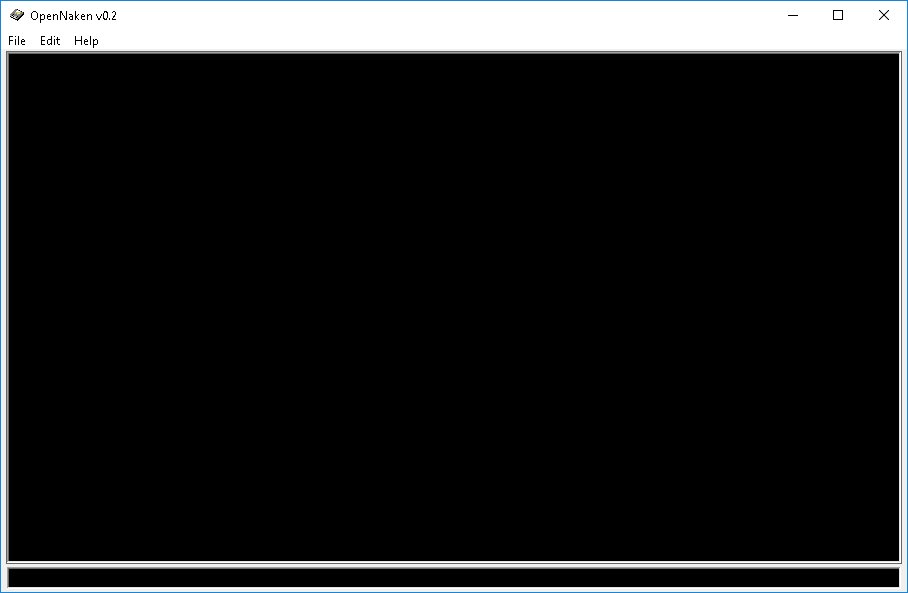

# onc

onc is a chat client with a GUI for Michael Kohn's Nakenchat (www.naken.cc).
It was originally written in 2000 against the Win32 API. It should run on
Windows 98 and higher.



# Building
On Windows you are expected to use mingw under the default cmd.exe console
host. Make sure to set your path to the mingw bin directory first. For example:

```
set PATH=%PATH%;d:\mingw64\bin

mingw32-make
```

# Code structure

Library files are in the lib directory. These are supposed to be shared with
other apps. The main app is in the root directory.
